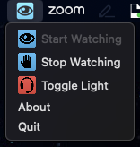

# MacOS Meeting Watcher
A MacOS system tray application that can toggle an MQTT switch on and off.

The application can detect meetings in two ways:
1. Watching for Zoom meetings using the process.
2. Watching for an in-use microphone.

The application is written in Python and uses the [rumps](https://rumps.readthedocs.io/en/latest/index.html) module.

## Screenshots
|Image|Description|
|---|---|
||Application Menu|
||Watching for Meeting|
||In a Meeting|


## Installation
### Release Version (binary application)
1. Download the latest release from the [releases](https://gitlab.com/bz0qyz/osx-meeting-watcher/-/releases) page.
2. Unzip the downloaded file.
3. Move the unzipped file to the Applications folder.
4. Open the application.
5. Authorize the unsigned application by going to `System Preferences > Security & Privacy > General` and clicking `Open Anyway`. See [HERE](https://support.apple.com/guide/mac-help/apple-cant-check-app-for-malicious-software-mchleab3a043/13.0/mac/13.0) for more information.
6. The application will appear in the system tray.

### Development Version
1. Clone the repository.
2. Install the required packages.
    ```bash
    pip install -r requirements.txt
    ```
3. Build the application.
    ```bash
    ./build-app.sh
    ```
4. Move the built application from the `dist` directory to the Applications folder.
5. Open the application.
6. The application will appear in the system tray.

## Configuration
When the application is first launched, a configuration file will be created in the user's home directory.
`~/.confg/meeting-watcher/config.json`
Edit the file and add the host, credentials and a topic for the MQTT broker.
